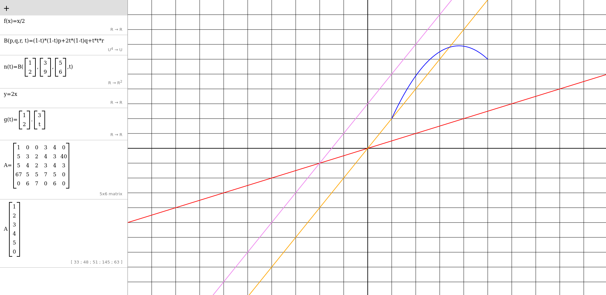

# calc
Web-based graphing calculator with support for vector-valued functions and other features.

Currently supported objects:
* (Real, Complex) Numbers
* Matrices
* Functions
   * Functions `R -> R` and `[0, 1] -> R^2` can be graphed.
Planned:
* Vector/scalar fields
* Arithemetic on fields with nonzero characteristic

This project is very much incomplete.

## Setup
1. Clone this repo
2. `cargo build`
3. `python3 -m http.server`
